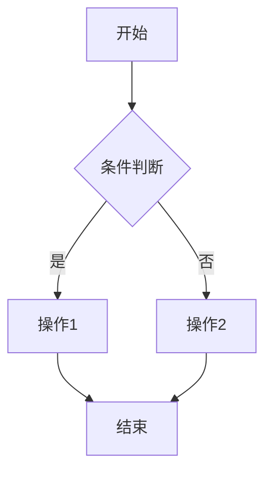

# Mermaid 语法测试说明

## ❓ 为什么你看不到图表？

你看到的是 **源代码**（文本形式），不是渲染后的图表。这是因为：

1. **聊天界面**：在文本聊天中，我只能显示原始代码
2. **需要渲染环境**：Mermaid 代码需要浏览器环境来渲染成图表

## ✅ 查看方法

### 方法1：直接访问测试页面（推荐）
**网址：** `http://你的服务器IP/mermaid-viewer.html`

或本地访问：
```bash
# 如果服务器在本地
http://localhost/mermaid-viewer.html

# 如果服务器在公网
http://你的公网IP/mermaid-viewer.html
```

### 方法2：使用在线工具
1. 打开 [Mermaid Live Editor](https://mermaid.live)
2. 粘贴以下代码：



3. 点击 "Render" 查看图表

### 方法3：VS Code 插件
1. 安装 VS Code
2. 安装插件：`Markdown Preview Mermaid Support`
3. 打开 `.md` 文件，预览即可看到图表

## 🧪 测试文件

我已创建以下测试文件：

### 1. `mermaid-test.html` - 完整测试页面
- 包含5种图表类型
- 深色主题支持
- 直接浏览器打开即可

### 2. `mermaid-test.md` - Markdown测试文件
- 适合VS Code预览
- 包含所有图表代码

### 3. `mermaid-viewer.html` - 在线查看器
- 已部署到Web目录
- 可直接通过URL访问

## 📊 测试内容

测试页面包含：

1. **流程图** - 基本流程控制
2. **序列图** - 用户交互流程
3. **状态图** - 状态转换
4. **饼图** - 数据分布
5. **甘特图** - 项目计划

## 🔧 前端支持验证

根据你的代码分析，前端已完整支持Mermaid：

✅ CDN 引入 Mermaid 11  
✅ 渲染逻辑完整（`language-mermaid` 代码块识别）  
✅ 深色主题配置  
✅ 样式支持（`.mermaid-wrapper`）  

## 🚀 快速测试

现在你可以：

1. **访问测试页面**：`http://你的服务器IP/mermaid-viewer.html`
2. **查看渲染效果**：应该能看到5个不同的图表
3. **验证功能**：确认图表可以正常显示和交互

如果看到图表，说明Mermaid支持正常工作！🎉