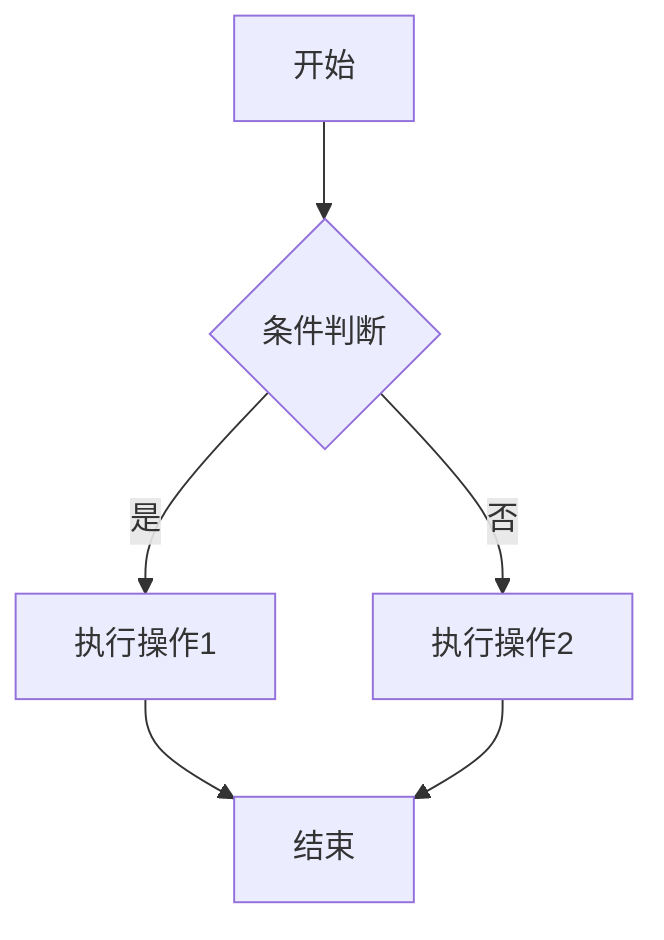
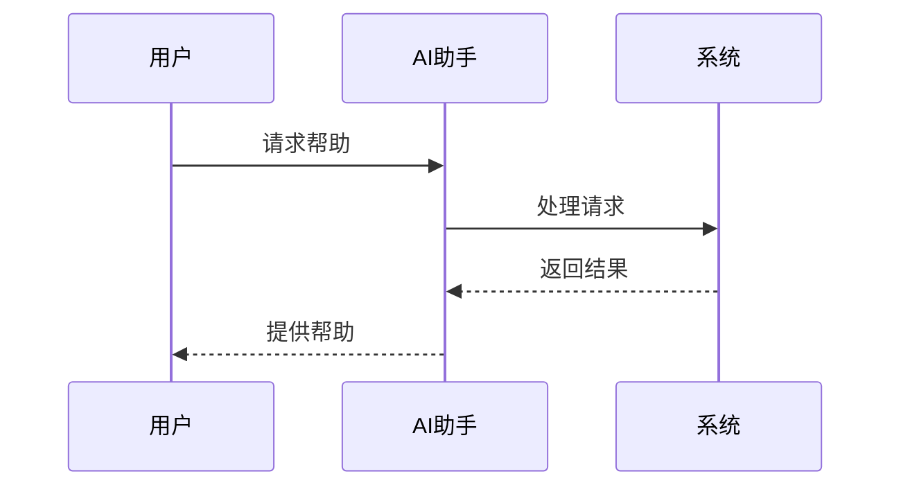
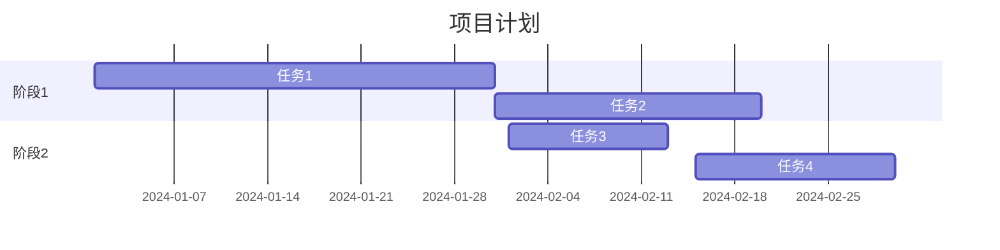
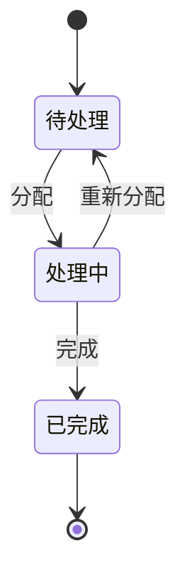

# Mermaid 语法测试

## 流程图示例

```mermaid
graph TD
    A[开始] --> B{条件判断}
    B -->|是| C[执行操作1]
    B -->|否| D[执行操作2]
    C --> E[结束]
    D --> E
```

## 序列图示例

```mermaid
sequenceDiagram
    participant 用户
    participant AI助手
    participant 系统
    用户->>AI助手: 请求帮助
    AI助手->>系统: 处理请求
    系统-->>AI助手: 返回结果
    AI助手-->>用户: 提供帮助
```

## 甘特图示例

```mermaid
gantt
    title 项目计划
    dateFormat  YYYY-MM-DD
    section 阶段1
    任务1           :a1, 2024-01-01, 30d
    任务2           :after a1, 20d
    section 阶段2
    任务3           :2024-02-01, 12d
    任务4           :2024-02-15, 15d
```

## 状态图示例

```mermaid
stateDiagram-v2
    [*] --> 待处理
    待处理 --> 处理中 : 分配
    处理中 --> 已完成 : 完成
    处理中 --> 待处理 : 重新分配
    已完成 --> [*]
```