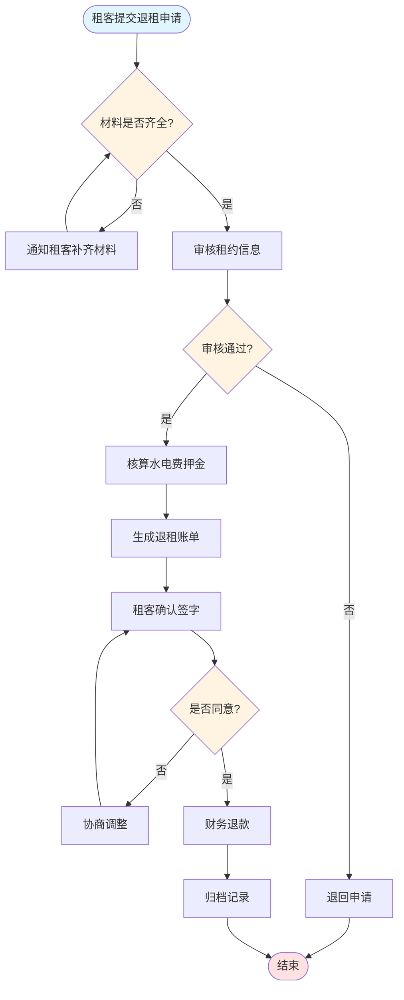
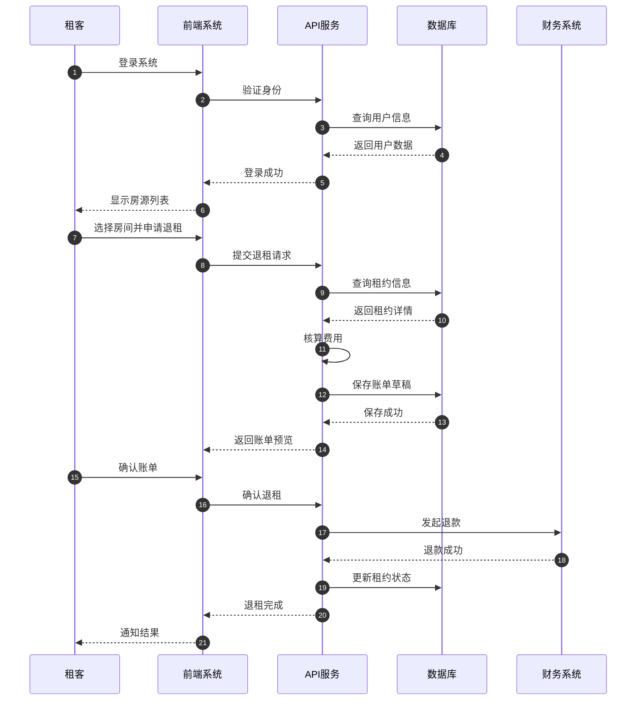
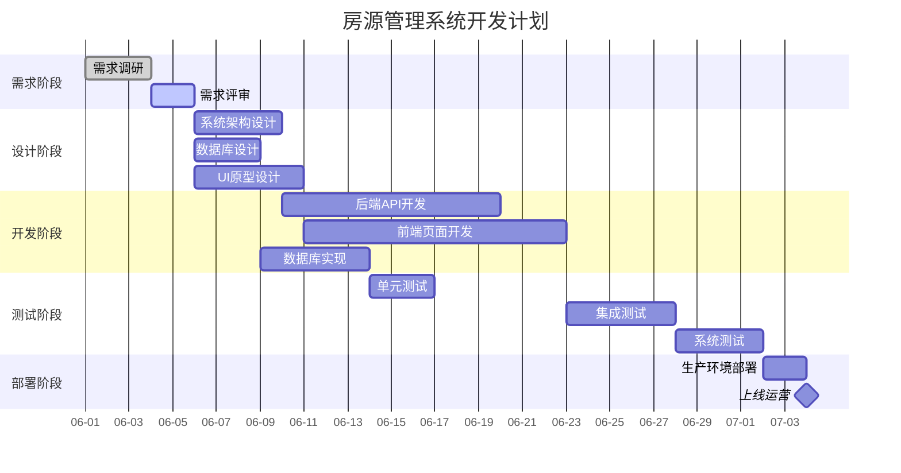

# Mermaid 图表示例

## 1. 流程图 (Flowchart) - 退租申请处理流程

## 2. 时序图 (Sequence Diagram) - 退租系统交互

## 3. 甘特图 (Gantt Chart) - 房源管理系统开发计划

---

## 渲染说明

上面的代码块使用 \`mermaid\` 标记，可以在以下环境渲染：
- GitHub / GitLab Markdown
- VS Code (需安装 Mermaid 插件)
- Typora / Obsidian
- 在线工具 https://mermaid.live

## Mermaid 语法速查

### 流程图常用元素
- `flowchart TD` / `LR` 方向
- `A-->B` 箭头连接
- `A{判断?}` 菱形判断
- `A([圆角])` 圆角/椭圆
- `A[(数据库)]` 圆柱形
- `style A fill:#颜色` 节点着色

### 时序图常用元素
- `participant` 定义参与者
- `->>` 实线箭头，`-->>` 虚线箭头
- `Note over` 添加注释
- `loop` / `alt` / `par` 块结构

### 甘特图常用元素
- `section` 分组
- `:done` / `:active` 状态标记
- `任务名 :id, after 任务id, 持续天数`
- `milestone` 里程碑
